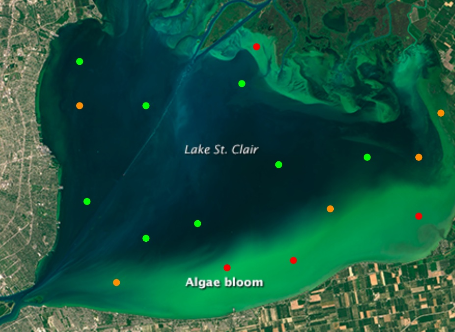

# CyFi: Cyanobacteria Finder

<div class="row">
  <div class="col-md-6">
    <div>
      <p>CyFi is a command line tool that uses satellite imagery and machine learning to estimate cyanobacteria levels in small, inland water bodies. Cyanobacteria is a type of harmful algal bloom (HAB), which can produce toxins that are poisonous to humans and their pets, and can threaten marine ecosystems.</p>
      <p>The goal of CyFi is to help water quality managers better allocate resources for in situ sampling, and make more informed decisions around public health warnings for critical resources like lakes and reservoirs.</p><p>Ultimately, more accurate and more timely detection of algal blooms helps keep both the human and marine life that rely on these water bodies safe and healthy.</p>
    </div>
  </div>
  <div class="col-md-6">
    <div>
      
      <p style="font-size: 0.75em"><em>Stylized view of severity estimates for points on a lake with a cyanobacteria bloom.</em><br>Base image from <a href="https://landsat.visibleearth.nasa.gov/view.php?id=86327">NASA Landsat Image Gallery</a></p>
    </div>
  </div>
</div>


## Quickstart

### Install

Install CyFi with pip:

```
pip install cyfi
```

For detailed instructions for those installing python for the first time, see the [Installation](https://cyfi.drivendata.org/stable/installation) docs.

### Generate batch predictions

Generate batch predictions at the command line with `cyfi predict`.

First, specify your sample points in a csv with the following columns:

* latitude
* longitude
* date

For example, `sample_points.csv` could be:

<div class="table-container-class">
    <table>
        <tr>
            <th>latitude</th>
            <th>longitude</th>
            <th>date</th>
        </tr>
        <tr>
            <td>41.424144</td><td>-73.206937</td><td>2023-06-22</td>
        </tr>
        <tr>
            <td>36.045</td><td>-79.0919415</td><td>2023-07-01</td>
        </tr>
        <tr>
            <td>35.884524</td><td>-78.953997</td><td>2023-08-04</td>
        </tr>
    </table>
</div>

Then run:
```
cyfi predict sample_points.csv
```

This will output a `preds.csv` that contains a column for cyanobacteria density and a column for the associated severity level based on WHO thresholds:

<div class="table-container-class">
    <table>
        <tr>
            <th>sample_id</th>
            <th>date</th>
            <th>latitude</th>
            <th>longitude</th>
            <th>density_cells_per_ml</th>
            <th>severity</th>
        </tr>
        <tr>
            <td>7ff4b4a56965d80f6aa501cc25aa1883</td>
            <td>2023-06-22</td>
            <td>41.424144</td>
            <td>-73.206937</td>
            <td>34173.0</td>
            <td>moderate</td>
        </tr>
        <tr>
            <td>882b9804a3e28d8805f98432a1a9d9af</td>
            <td>2023-07-01</td>
            <td>36.045</td>
            <td>-79.0919415</td>
            <td>7701.0</td>
            <td>low</td>
        </tr>
            <td>10468e709dcb6133d19a230419efbb24</td>
            <td>2023-08-04</td>
            <td>35.884524</td>
            <td>-78.953997</td>
            <td>4053.0</td>
            <td>low</td>
        <tr>
        </tr>
    </table>
</div>

To see all of the available options, run `cyfi predict --help`.

### Generate prediction for a single point

Or, generate a cyanobacteria estimate for a single point on a single date using `cyfi predict-point`.

Just specify the latitude, longitude, and date as arguments at the command line.

```
cyfi predict-point --lat 41.2 --lon -73.2 --date 2023-09-14
```

This will print out the estimated cyanobacteria density and associated severity level based on WHO thresholds.

```
2023-10-04 16:25:40.581 | SUCCESS  | cyfi.cli:predict_point:154 - Estimate generated:
date                    2023-09-14
latitude                      41.2
longitude                    -73.2
density_cells_per_ml        32,820
severity                  moderate
```

To see all of the available options, run `cyfi predict-point --help`.

------

## About the model

CyFi was born out of the [Tick Tick Bloom](https://www.drivendata.org/competitions/143/tick-tick-bloom/) machine learning competition, hosted by DrivenData. The goal in that challenge was to detect and classify the severity of cyanobacteria blooms in small, inland water bodies using publicly available satellite, climate, and elevation data. Labels were based on "in situ" samples that were collected manually by [many organizations](https://www.drivendata.org/competitions/143/tick-tick-bloom/page/651/#about-the-project-team) across the U.S. The model in CyFi is based on the [winning solutions](https://github.com/drivendataorg/tick-tick-bloom) from that challenge, and has been optimized for generalizability and efficiency.

### Why use machine learning

Machine learning is particularly well-suited to this task because indicators of cyanobacteria are visible from free, routinely collected data sources. Whereas manual water sampling is time and resource intensive, machine learning models can generate estimates in seconds. This allows water managers to prioritize where water sampling will be most beneficial, and can provide a birds-eye view of water conditions across the state.

### Data sources

CyFi relies on two data sources as input:

**Sentinel-2 satellite imagery**

*  Sentinel-2 is a wide-swath, high-resolution, multi-spectral imaging mission. It supports the monitoring of vegetation, soil and water cover, as well as observation of inland waterways and coastal areas. The Sentinel-2 Multispectral Instrument (MSI) samples [13 spectral bands](https://docs.sentinel-hub.com/api/latest/data/sentinel-2-l2a/#available-bands-and-data): four bands at 10 metres, six bands at 20 metres and three bands at 60 metres spatial resolution. The mission provides a global coverage of the Earth's land surface every 5 days. Sentinel-2 data is accessed through Microsoft's [Planetary Computer](https://planetarycomputer.microsoft.com/dataset/sentinel-2-l2a).

**Land cover map**

* The Climate Research Data Package (CRDP) Land Cover Gridded Map (2020) classifies land surface into 22 classes, which have been defined using the United Nations Food and Agriculture Organization's Land Cover Classification System (LCCS). This map is based on data from the Medium Resolution Imaging Spectrometer (MERIS) sensor on board the polar-orbiting Envisat-1 environmental research satellite by the European Space Agency. This data comes from the CCI-LC database hosted by the ESA Climate Change Initiative's Land Cover project.

### Overview of the model

Each observation (or "sampling point") is a unique combination of date, latitude, and longitude.

Example input csv row:

<table style='width:70%;'>
    <tr>
        <td>latitude</td>
        <td>longitude</td>
        <td>date</td>
    </tr>
    <tr>
        <td>41.424144</td>
        <td>-73.206937</td>
        <td>2023-06-22</td>
    </tr>
</table>

Satellite imagery feature generation for each observation is as follows:

- identify relevant Sentinel-2 tiles based on
    - a bounding box of 2,000m around the sampling point
    - a time range of 30 days prior to (and including) the sampling date
- select the most recent image that has a bouding box containing fewer than 5% of cloud pixels
- filter the pixels in the bounding box to the water area using the [scene classification (SCL) band](https://sentinels.copernicus.eu/web/sentinel/technical-guides/sentinel-2-msi/level-2a/algorithm-overview)
- generate summary statistics (e.g., mean, max, min) and ratios (e.g, NDVI) using the 15 Sentinel-2 bands

The land cover value for each sampling point is looked up from the static land cover map, and added to the satellite features.

Example features csv row:

<div class="table-container-class">
    <table>
        <tr>
            <th>B01_mean</th><th>B02_mean</th><th>B03_mean</th><th>B04_mean</th><th>B05_mean</th><th>B06_mean</th><th>B07_mean</th><th>B08_mean</th><th>B09_mean</th><th>B11_mean</th><th>B12_mean</th><th>B8A_mean</th><th>WVP_mean</th><th>AOT_mean</th><th>percent_water</th><th>green95th</th><th>green5th</th><th>green_red_ratio</th><th>green_blue_ratio</th><th>red_blue_ratio</th><th>green95th_blue_ratio</th><th>green5th_blue_ratio</th><th>NDVI_B04</th><th>NDVI_B05</th><th>NDVI_B06</th><th>NDVI_B07</th><th>AOT_range</th><th>month</th><th>days_before_sample</th><th>land_cover</th>
        </tr>
        <tr>
            <td>548.1</td><td>1341.6</td><td>1607.3</td><td>1613.8</td><td>234.0</td><td>287.7</td><td>265.3</td><td>2929.3</td><td>3316.7</td><td>362.7</td><td>153.3</td><td>171.7</td><td>1742.8</td><td>76.0</td><td>7.14e-05</td><td>3919.0</td><td>711.6</td><td>0.996</td><td>1.2</td><td>1.2</td><td>2.9</td><td>0.5</td><td>0.3</td><td>0.9</td><td>0.8</td><td>0.8</td><td>0.0</td><td>5</td><td>6</td><td>130</td>
        </tr>
    </table>
</div>

Cyanobacteria estimates are then generated by a [LightGBM model](https://github.com/microsoft/LightGBM), a gradient-boosted decision tree algorithm. The model was trained using "in situ" labels collected manually by [many organizations](https://www.drivendata.org/competitions/143/tick-tick-bloom/page/651/#about-the-project-team) across the U.S. 

Density values are discretized into severity buckets using the WHO guidlines.

**Severity buckets**  

- Low: 0 - 20,000 cells/ml
- Moderate: 20,000 - 100,000 cells/ml
- High: > 100,000 cells/ml

Example predictions csv row:

<div class="table-container-class">
    <table>
        <tr>
            <th>date</th>
            <th>latitude</th>
            <th>longitude</th>
            <th>density_cells_per_ml</th>
            <th>severity</th>
        </tr>
        <tr>
            <td>2019-08-26</td>
            <td>38.9725</td>
            <td>-94.67293</td>
            <td>426593.0</td>
            <td>high</td>
        </tr>
    </table>
</div>
