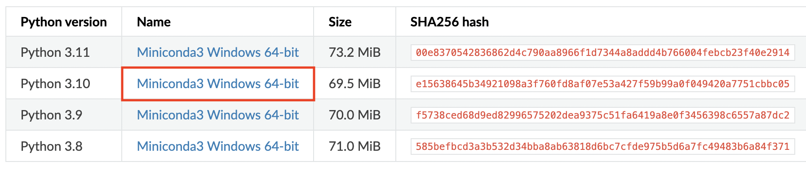
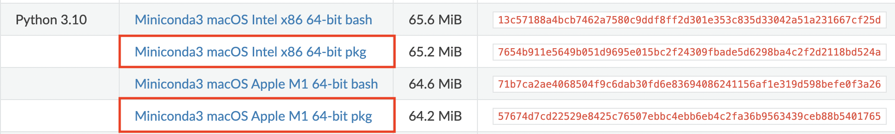
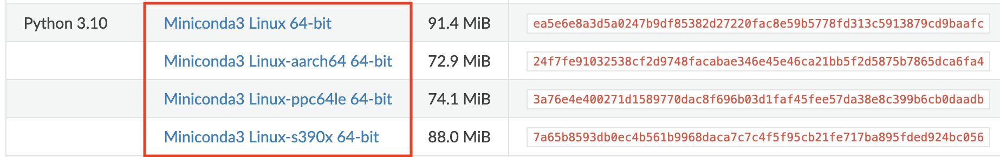

<!-- Google tag (gtag.js) -->
<script async src="https://www.googletagmanager.com/gtag/js?id=G-4DJJ6JZ04E"></script>
<script>
  window.dataLayer = window.dataLayer || [];
  function gtag(){dataLayer.push(arguments);}
  gtag('js', new Date());
  gtag('config', 'G-4DJJ6JZ04E');
</script>

# Installation

CyFi requires python 3.10 or later.

If you already have python 3.10+ installed, simply run `pip install cyfi` and then head over to the [Quickstart](../#quickstart) page to learn how to generate cyanobacteria predictions.

If you don't have python installed, we strongly recommend using Miniconda. Miniconda is a tool to manage your Python environments and package dependencies. It is a lightweight version of Anaconda that includes only conda, Python, the packages they both depend on, and a small number of other useful packages (like pip).

Follow the instructions for your operating system below to install python (with Miniconda) and CyFi.

- [Windows instructions](#windows-instructions)
- [MacOS instructions](#macos-instructions)
- [Linux instructions](#linux-instructions)

------

## Windows instructions

### Install python

1. [Download the Miniconda installer](https://docs.conda.io/projects/miniconda/en/latest/miniconda-other-installer-links.html#windows-installers) by clicking on the link for "Miniconda3 Windows 64-bit" for Python 3.10


2. Double-click the downloaded .exe file

3. Follow the instructions on the screen. If you are unsure about any setting, accept the defaults.


### Install CyFi

Once the Miniconda installation has finished,

1. From the Start menu, open Anaconda Prompt

2. Type `pip install cyfi` and hit enter

3. To check that CyFi has been installed, run `pip show cyfi`

```
$ pip show cyfi
Name: cyfi
Version: 0.1.0
Summary: CyFi is a Python package to estimate cyanobacteria density in small, inland water bodies using Sentinel-2 satellite imagery.
```

------

## MacOS instructions

### Install python

1. Look up your computer's chip by clicking on the apple in the top left corner of the screen, selecting "About this mac" and looking at "chip"

2. [Download the Miniconda installer](https://docs.conda.io/projects/miniconda/en/latest/miniconda-other-installer-links.html#macos-installers) by clicking on the link for "Miniconda3 macOS" for Python 3.10.</br>If you have an M1 chip, make sure to click on the "Apple M1" link. </br>If you have an Intel chip, make sure to click on the "Intel x86" link.
  

3. Double-click the .pkg file.

4. Follow the instructions on the screen. If you are unsure about any setting, accept the defaults.

### Install CyFi

Once the Miniconda installation has finished,

1. Open the terminal by typing ⌘+space (to open spotlight search) and then typing "Terminal". Hit enter.

2. Type `pip install cyfi` and hit enter

3. To check that CyFi has been installed, run `pip show cyfi`

```
$ pip show cyfi
Name: cyfi
Version: 0.1.0
Summary: CyFi is a Python package to estimate cyanobacteria density in small, inland water bodies using Sentinel-2 satellite imagery.
```

------

## Linux instructions

### Install python

1. Look up your computer's architecture by running `lscpu` in your terminal and looking at "architecture"

2. [Download the Miniconda installer](https://docs.conda.io/projects/miniconda/en/latest/miniconda-other-installer-links.html#linux-installers) by clicking on the "Miniconda3 Linux" link for your architecture for Python 3.10


3. In your terminal, run `bash filename`, replacing `filename` with the path to your installer.

4. Follow the prompts on the installer screens. If you are unsure about any setting, accept the defaults.

5. To make the changes take effect, close and then re-open your terminal window.


### Install CyFi

1. In your terminal, run `pip install cyfi`

2. To check that CyFi has been installed, run `pip show cyfi`

```
$ pip show cyfi
Name: cyfi
Version: 0.1.0
Summary: CyFi is a Python package to estimate cyanobacteria density in small, inland water bodies using Sentinel-2 satellite imagery.
```
