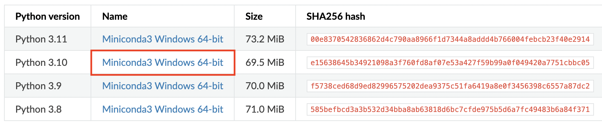
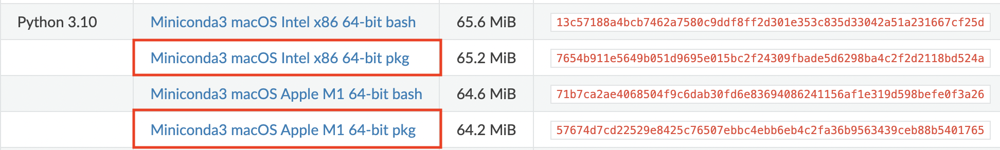
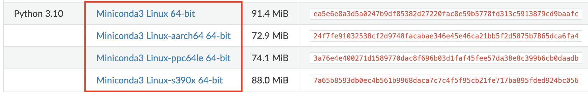

# Installation

CyFi requires python 3.10 or later.

If you already have python 3.10+ installed, simply run `pip install cyfi` and then head over to the [Quickstart] page to learn how to generate cyanobacteria predictions. 

If you don't have python installed, we strongly recommend using Miniconda. Miniconda is a light-weight version of Anaconda that includes only conda, Python, the packages they both depend on, and a small number of other useful packages (like pip).

Follow the instructions for your operating system below to install python (with Miniconda) and CyFi.

- [Windows instructions]
- [MacOS instructions]
- [Linux instructions]

## Windows instructions

1. Install python

- [Download the Miniconda installer](https://docs.conda.io/projects/miniconda/en/latest/miniconda-other-installer-links.html#windows-installers) by clicking on the link for "Miniconda3 Windows 64-bit" for Python 3.10
- Double-click the downloaded .exe file
- Follow the instructions on the screen. If you are unsure about any setting, accept the defaults.



2. Install CyFi

Once the Miniconda installation has finished,

- From the Start menu, open Anaconda Prompt
- Type `pip install cyfi` and hit enter
- To check that CyFi has been installed, run `pip show cyfi`

```bash
$ pip show cyfi
Name: cyfi
Version: 0.1.0
Summary: CyFi is a Python package to estimate cyanobacteria density in small, inland water bodies using Sentinel-2 satellite imagery.
```

## MacOS instructions

1. Install python

- Look up your computer's chip by clicking on the apple in the top left corner of the screen, selecting "About this mac" and looking at "chip"
- [Download the Miniconda installer](https://docs.conda.io/projects/miniconda/en/latest/miniconda-other-installer-links.html#macos-installers) by clicking on the link for "Miniconda3 macOS" for Python 3.10
  - If you have an M1 chip, make sure to click on the "Apple M1" link
  - If you have an Intel chip, make sure to click on the "Intel x86" link
- Double-click the .pkg file.
- Follow the instructions on the screen. If you are unsure about any setting, accept the defaults.



2. Install CyFi

Once the Miniconda installation has finished,

- Open the terminal by typing ⌘+space (to open spotlight search) and then typing "Terminal". Hit enter.
- Type `pip install cyfi` and hit enter
- To check that CyFi has been installed, run `pip show cyfi`

```bash
$ pip show cyfi
Name: cyfi
Version: 0.1.0
Summary: CyFi is a Python package to estimate cyanobacteria density in small, inland water bodies using Sentinel-2 satellite imagery.
```

## Linux instructions

1. Install python

- Look up your computer's architecture by running `lscpu` in your terminal and looking at "architecture"
- [Download the Miniconda installer](https://docs.conda.io/projects/miniconda/en/latest/miniconda-other-installer-links.html#linux-installers) by clicking on the "Miniconda3 Linux" link for your architecture for Python 3.10
- In your terminal, run `bash filename`, replacing `filename` with the path to your installer.
- Follow the prompts on the installer screens. If you are unsure about any setting, accept the defaults.
- To make the changes take effect, close and then re-open your terminal window.



2. Install CyFi

- In your terminal, run `pip install cyfi`
- To check that CyFi has been installed, run `pip show cyfi`

```bash
$ pip show cyfi
Name: cyfi
Version: 0.1.0
Summary: CyFi is a Python package to estimate cyanobacteria density in small, inland water bodies using Sentinel-2 satellite imagery.
```
